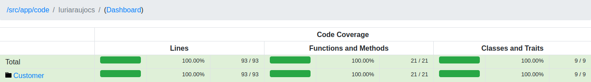

## Magento 2 module - Iuriaraujocs Customer Registration

Once a new customer is being registered, the extension checks the First Name field. If the First
Name field has whitespaces, they must be removed, so the customer entity is saved
without whitespaces in the First Name property.

### The main feature is:

- Firstname custom rule on registration
- Log customer data after registration
- Send custom email with customer data
- Backoffice/Admin Flag for enable/disable the features


### How to use
```php
    composer require iuriaraujocs/magento2-module-customer-registration
  ```
****
### Backoffice Configuration
 ``
 Stores > Configuration > Iuriaraujocs Extension > Customer Registration
``

### Unit Test - Coverage

